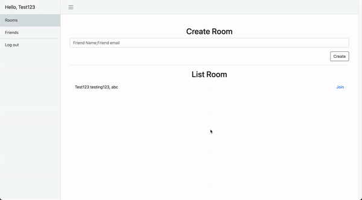
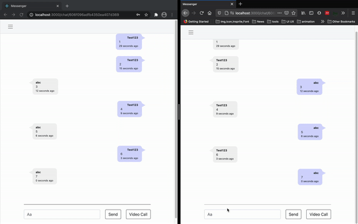
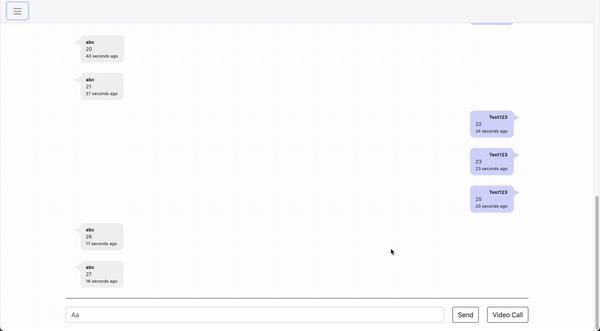
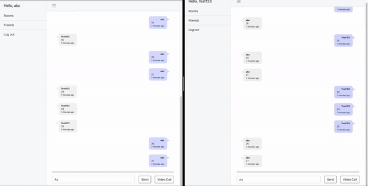

# let's-chat

## Overview

- Friend:

  - User can add friends by using friend's id number.
  - User can unfriend. This will also remove all chat messages and rooms related to the removed friend.

- Chatroom:

  - Each room will have only 2 chat members.
  - User can create a room with a friend.
  - User can start or receive calls.
  - User can send or receive messages.

- Notification:

  - Notification will be pushed with the chat message.

- Authentication:
  - User can create an account.
  - Login.
  - If user forgets his/her password, the user can request a reset password with email.
  - Logout.

## Technical overview

- Nodejs, Express, React, Socket.io, WebRTC, Mongodb
- Webpush, service worker for notifcation.
- nodemailer for email.
- Auth:
  - 256 hash function for password and reset token.
  - JWT

## Demo

### Forget Password

- The requested URL will be attached with the token that will be expired after 2 minutes.

### Create Room

- The format for the input is: `<username>;<email>`
- The search function is built with debounce. This helps reduce the number of request.

### Chat and notification

- The application will stored `endpoint` in database. When the user receive message, server will push notification to all `endpoint`.
- `endpoint` for specific machine will be removed when user log out using that machine.
  

### Load older message

- Pagination was implemented. Each time, user scroll to the top, the application will load 10 older messages until reaching the last message. After reach the last message, the application will not push any request even user scroll to the top.

### Call

- There are `Modal` telling user what error occured:
  - User's friend didn't turn on his/her camera and microphone.
  - User didn't turn on his/her camera and microphone.
  - User recevie phone call.
  - User's friend is currently offline.
  - Call end.

